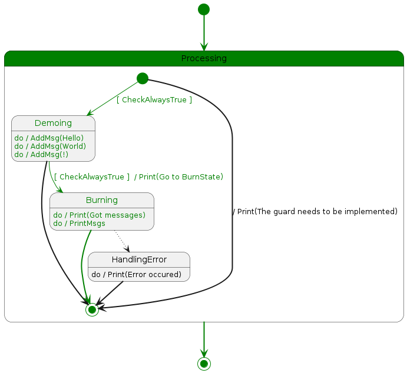

# Cli Features
This file explains the different cli commands.

## gen
Executing `sc gen --name myctl` will generate 
all missing or regenerated code for the controller
based on the file at `CTL_ROOT/CTL_NAME/CTL_NAME.plantuml`.
It will always regenerate the `zz_gen_sm.go` file, 
which contains the paths and states of the state chart. 
It will not overwrite existing customizable files. 
When writing something it will use templates over the default generation.
So when generating an action it will use the template if available,
but it would not overwrite an existing action with that template.  

### --clear
The `sc` tool automatically detects no longer needed actions and guards
and prints a message during the generation process.
By adding the option `--clear` these files are removed automatically.

### --force-generated
By adding the flag `--force-generated` all files,
which are marked as generated,
are written again.
This may be useful to apply template changes.

## path
Executing `sc path --name myctl --route route.json --out-dir src/controller/integration` will generate
a visualization of the path taken through the state machine. 
It create / overwrites a file named `myctl.route.plantuml` 
in your current directory. 




## import
Executing `sc import` will download the templates,
which are configured in `sc.yaml`,
to the target directories.
Afterwards the templates,
if also set as templates in `sc.yaml`,
are available to the `sc gen` command.
Currently only Github repositories are supported. 

### Add an import
1. In `sc.yaml` add the following with your own configuration.
```yaml
imports:
- repoOwner: "SoenkeD"
  repoName: "sc-go-templates"
  repoPath: "sc/templates/"
  localPath: "sc/templates/"
  # token: "abcdefg1245"
```

2. Add the template to `sc.yaml`
```yaml
templates:
  - dir: "sc/templates"
```
## init
Executing `sc init` initializes a project
based on a Github repository.
Find a sc template repository and
follow the instructions there. 

Golang example:
```bash
sc init --setup https://github.com/SoenkeD/sc-go-templates/main/sc/setup \
	--name myctl \
	--root $PWD/demo  \
	--module demo
```
`--name` is the name of the first controller to create \
`--root` is the desired root of the project (the directory should not exist) \
`--module` is the name of the desired Golang module e.g. `github.com/SoenkeD/sc` \
`--container` can be used to enable podman (defaults to docker) \
`--ctl` can be used to overwrite the default ctl dir of the setup template

## export
tbd.

## extend
The `sc extend` command can be used to extend a template `.plantuml` file.
This may be useful when having e.g. a shared initialization and closing phase
for some controllers. 

### Example
The template:
```
@startuml template

[*] -[bold]-> Initializing

state Initializing {
  [*] -[bold]-> InitializingClient

  InitializingClient: do / InitClient
  InitializingClient -[bold]-> [*]
}
Initializing -[dotted]-> Closing
Initializing -[bold]-> Processing

Processing -[dotted]-> Closing
Processing -[bold]-> Closing

state Closing {
  [*] --> HandlingError : [ HasError ]
  [*] -[bold]-> [*]

  HandlingError: do / SetErrorMsg
  HandlingError: do / ClearError
  HandlingError -[bold]-> [*]
}

Closing -[bold]-> [*]
```

The extension:
```
@startuml extension

state Processing {
  [*] -[bold]-> Loading

  Loading: do / Load
  Loading -[bold]-> Writing

  Writing: do / Write
  Writing -[bold]-> [*]
}
```

Run:
```bash
sc extend --template path/to/template.plantuml --extension path/to/extension
```
You can add multiple extensions. 
The first line in the each file will be removed and 
replace with `@startuml CTL_NAME`.

## version
To check if the most recent version of `sc` is installed
run `sc version`.
If a newer version exists it will ask to install the new version.
Then executing `sc version --update` the most recent version of `sc`
will be installed / reinstalled. 